Universidade Federal de Lavras – Departamento de Ciência da Computação\
Redes de Computadores – Prof. Hermes Pimenta de Moraes Júnior\
Lavras, 25 de setembro de 2026

# Identificação

## Integrantes do grupo

| Nome completo | Turma |
| --- | --- |
| Giovane Felipe Godoi Oliveira | 10A |
| Luis Fellipe Resende Lima | 10A |
| Vincent Biazotti Collares | 10A |

## Máquinas virtuais utilizadas

| VM | Nome (hostname) | IP | Sistema operacional | Serviços |
| --- | --- | --- | --- | --- |
| VM1 | vm07 | 192.168.1.7 | Debian 11.11 (bullseye) | Sincronização de hora (Chrony); DNS na etapa 2 |
| VM2 | vm08 | 192.168.1.8 | Debian 11.11 (bullseye) | Servidor Web HTTP/HTTPS (Apache); FTP na etapa 2 |

As VMs são acessadas por SSH através da VPN do Laboratório Virtual, na rede 192.168.1.0/24.

# Etapa executada

Etapa 1: instalação e configuração do serviço de sincronização de hora e do servidor Web.

- **Sincronização de hora (Chrony):** a VM1 (vm07) obtém a hora dos servidores do projeto NTP.br e serve essa hora para a VM2 (vm08).
- **Servidor Web (Apache):** a VM2 (vm08) hospeda a página do grupo, o relatório e o repositório de trabalhos, atendendo por HTTP (porta 80) e HTTPS (porta 443).

# Passo a passo: acesso ao Laboratório Virtual

O computador usado roda Fedora Linux, enquanto o tutorial da disciplina é voltado a Debian e Ubuntu. Os passos foram adaptados como segue.

1. Instalação do plugin OpenVPN do NetworkManager (equivalente Fedora do pacote `network-manager-openvpn-gnome`):

    `sudo dnf install -y NetworkManager-openvpn-gnome`

2. Importação do perfil `laboratorio.ovpn` baixado do Campus Virtual. Os certificados e a chave já vêm embutidos no próprio arquivo:

    `nmcli connection import type openvpn file laboratorio.ovpn`

3. Definição do usuário institucional (parte do e-mail antes do @):

    `nmcli connection modify laboratorio vpn.user-name vincent.collares`

4. Configuração para que apenas o tráfego destinado ao laboratório passe pela VPN:

    `nmcli connection modify laboratorio ipv4.never-default yes`

5. Conexão, informando a senha dos sistemas da UFLA:

    `nmcli connection up laboratorio --ask`

6. Verificação da interface do túnel e das rotas recebidas. A interface `tun0` recebeu um IP da rede 192.168.2.0/24 e foi criada a rota para a rede das VMs, 192.168.1.0/24:

    `ip -br a | grep tun0` e `ip route | grep tun0`

7. Primeiro acesso a cada VM com o usuário padrão e troca imediata da senha:

    `ssh aluno@192.168.1.7` e `ssh aluno@192.168.1.8`, seguidos de `passwd` em cada VM

8. Conferência das VMs: permissão de sudo, nome, IP, versão do sistema e acesso à Internet:

    `sudo -v`, `hostname`, `ip -br a`, `cat /etc/debian_version` e `ping -c3 a.ntp.br`

Os usuários `moraes` e `mendes` foram mantidos sem alterações, e nenhum firewall foi instalado.

# Passo a passo: sincronização de hora

Foi usado o Chrony, serviço nativo do Debian sugerido no enunciado. A VM1 atua como cliente do NTP.br e como servidora para a VM2.

## VM1 (vm07, 192.168.1.7): cliente do NTP.br e servidora de hora

1. Instalação do Chrony, que substitui automaticamente o `systemd-timesyncd`, e ajuste do fuso horário:

```bash
sudo apt update
sudo apt install -y chrony
sudo timedatectl set-timezone America/Sao_Paulo
```

2. Desativação do pool padrão do Debian, para que a hora venha apenas do NTP.br:

```bash
sudo sed -i 's/^pool /#pool /' /etc/chrony/chrony.conf
```

3. Inclusão dos servidores do NTP.br e liberação da VM2 como cliente no arquivo `/etc/chrony/chrony.conf`. A diretiva `allow` autoriza a VM2 a consultar a hora, e `local stratum 10` mantém o serviço disponível mesmo sem acesso ao NTP.br:

```bash
server a.st1.ntp.br iburst
server b.st1.ntp.br iburst
server c.st1.ntp.br iburst
server d.st1.ntp.br iburst
server a.ntp.br iburst
server b.ntp.br iburst
server gps.ntp.br iburst

allow 192.168.1.8
local stratum 10
```

4. Reinício do serviço e ativação na inicialização:

```bash
sudo systemctl restart chrony
sudo systemctl enable chrony
```

## VM2 (vm08, 192.168.1.8): cliente da VM1

1. Instalação do Chrony, ajuste do fuso e desativação do pool padrão do Debian e das fontes recebidas por DHCP (`sourcedir`), para que a VM1 seja a única fonte:

```bash
sudo apt update
sudo apt install -y chrony
sudo timedatectl set-timezone America/Sao_Paulo
sudo sed -i -e 's/^pool /#pool /' -e 's/^sourcedir /#sourcedir /' /etc/chrony/chrony.conf
```

2. Definição da VM1 como única fonte de hora:

```bash
echo "server 192.168.1.7 iburst prefer" | sudo tee -a /etc/chrony/chrony.conf
```

3. Reinício do serviço e ativação na inicialização:

```bash
sudo systemctl restart chrony
sudo systemctl enable chrony
```

# Passo a passo: servidor Web (VM2, vm08)

Foi usado o Apache, servidor sugerido no enunciado, atendendo por HTTP e HTTPS sem redirecionamento entre os dois.

1. Instalação e ativação do Apache:

```bash
sudo apt install -y apache2
sudo systemctl enable --now apache2
```

2. Criação das pastas do relatório e do repositório de trabalhos, com permissão de escrita para o usuário do grupo:

```bash
sudo mkdir -p /var/www/html/relatorios /var/www/html/trabalhos
sudo chown -R aluno:www-data /var/www/html
sudo chmod -R 755 /var/www/html
```

3. Geração de um certificado autoassinado com validade de 365 dias, emitido para o IP da VM2:

```bash
sudo openssl req -x509 -nodes -days 365 -newkey rsa:2048 \
  -keyout /etc/ssl/private/grupo.key -out /etc/ssl/certs/grupo.crt \
  -subj "/C=BR/ST=MG/L=Lavras/O=UFLA/OU=DCC/CN=192.168.1.8" \
  -addext "subjectAltName=IP:192.168.1.8"
```

4. Ativação do módulo SSL, troca do certificado padrão pelo certificado do grupo no site `default-ssl` e ativação do site HTTPS:

```bash
sudo a2enmod ssl
sudo sed -i \
  -e 's#/etc/ssl/certs/ssl-cert-snakeoil.pem#/etc/ssl/certs/grupo.crt#' \
  -e 's#/etc/ssl/private/ssl-cert-snakeoil.key#/etc/ssl/private/grupo.key#' \
  /etc/apache2/sites-available/default-ssl.conf
sudo a2ensite default-ssl
sudo apache2ctl configtest
sudo systemctl reload apache2
```

5. Criação da página principal `/var/www/html/index.html`, com os nomes dos integrantes, a identificação das VMs e os links para os relatórios e os trabalhos da disciplina.

6. Envio do relatório e da pasta de trabalhos da disciplina (Socket TCP e UDP e Trabalho Prático em Packet Tracer) do computador pessoal para o servidor. A pasta é um repositório Git, então os trabalhos foram enviados com tar via SSH, excluindo a pasta .git e mantendo as subpastas:

```bash
scp relatorio-etapa1.pdf aluno@192.168.1.8:/var/www/html/relatorios/
tar --exclude=.git -czf - -C /home/vcollares/VINCENT/faculdade/5-periodo/redes \
  RedesDeComputadores | ssh aluno@192.168.1.8 "tar -xzf - -C /var/www/html/trabalhos/"
```

Endereços do site: `http://192.168.1.8` e `https://192.168.1.8`.

# Problemas e soluções

| Problema | Solução adotada |
| --- | --- |
| O tutorial de VPN da disciplina é voltado a Debian e Ubuntu, mas o computador usado roda Fedora. | Instalação do pacote equivalente `NetworkManager-openvpn-gnome` com `dnf` e importação do perfil pela linha de comando com `nmcli`. |
| Ao clicar no `laboratorio.ovpn` no Campus Virtual, o navegador exibia o conteúdo como texto em vez de baixar o arquivo. | O conteúdo foi salvo manualmente como arquivo `laboratorio.ovpn`. Os certificados já vinham embutidos, dispensando arquivos `.pem` separados. |
| Com a VPN ativa, todo o tráfego de Internet do computador passava pelo túnel, pois a VPN instalava uma rota padrão. | Configuração `ipv4.never-default yes`, que mantém pela VPN apenas as redes do laboratório (192.168.1.0/24 e 192.168.2.0/24). |
| Comandos colados no terminal zsh com comentários (`#`) foram interpretados de forma errada: a sessão SSH encerrou e o `passwd` rodou no computador local, sem alterar nada. | Execução de um comando por vez, sem comentários, conferindo pelo prompt se o terminal estava no computador local ou na VM. |
| Na VM2, o `chronyc sources` mostrava servidores da Internet (a.ntp.br, time.cloudflare.com) em vez da VM1: o arquivo `chrony.conf` continuava com a linha `pool 2.debian.pool.ntp.org` ativa e sem a linha `server 192.168.1.7`. | O arquivo foi inspecionado com `grep -Ev '^\s*(#|$)' /etc/chrony/chrony.conf`. As linhas `pool` e `sourcedir` foram comentadas, a linha `server 192.168.1.7 iburst prefer` foi adicionada e o Chrony foi reiniciado. Depois disso, a VM1 passou a ser a única fonte (`^* 192.168.1.7`). |
| No teste de correção da VM2, o comando `chronyc makestep` logo após alterar a hora para 2020 não corrigiu o relógio. O Chrony usava a última medição da VM1, feita antes da alteração, que indicava desvio quase nulo. | Foi forçada uma nova medição com `sudo chronyc burst 4/4` e, após alguns segundos, executado novamente `sudo chronyc makestep`. O relógio voltou de 01/01/2020 para a hora correta (25/09/2026). |
| Ao testar o Apache na VM2, o comando `curl` retornou "comando não encontrado": a VM tinha apenas a biblioteca `libcurl4`, sem o programa `curl`. | Instalação do programa com `sudo apt install -y curl`. Em seguida, `curl -I http://localhost` retornou `HTTP/1.1 200 OK`. |

# Verificação de funcionamento

Cada serviço foi testado com os procedimentos abaixo. Cada item traz o print da saída obtida.

## Sincronização de hora

1. Na VM1, conferência da fonte selecionada e do estado do relógio. Esperado: um servidor do NTP.br marcado com `^*` e `System clock synchronized: yes`.

```bash
chronyc sources -v
chronyc tracking
timedatectl
```

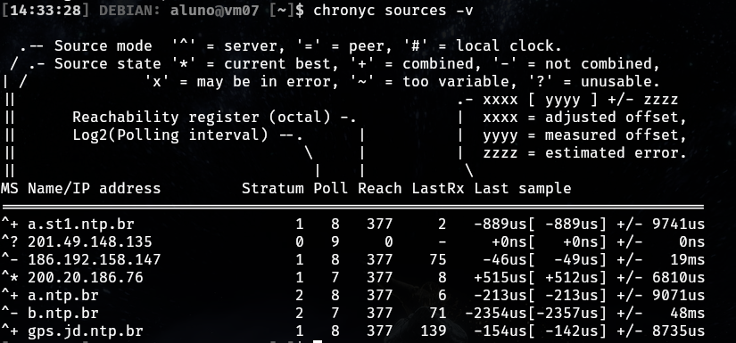

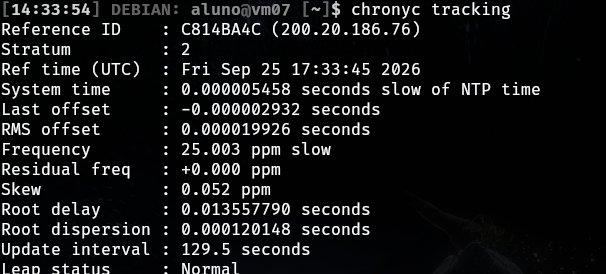

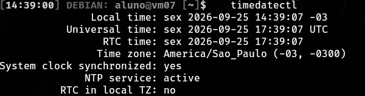

A vm07 consulta sete servidores do NTP.br e seleciona um servidor stratum 1 (`^*`, 200.20.186.76). Ela opera em stratum 2, com Leap status Normal e desvio de poucos microssegundos em relação à hora oficial. O timedatectl confirma o fuso America/Sao_Paulo e System clock synchronized: yes.

2. Na VM2, conferência de que a fonte de hora é a VM1. Esperado: `^* 192.168.1.7`.

```bash
chronyc sources -v
chronyc tracking
```

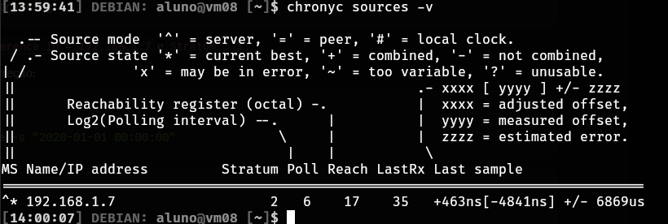

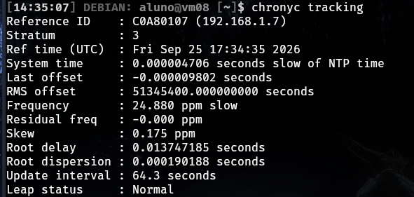

A vm08 usa apenas 192.168.1.7 como fonte (`^*`), com Reference ID 192.168.1.7 e stratum 3.

3. Na VM1, conferência de que a VM2 consulta o servidor. Esperado: o IP 192.168.1.8 na lista de clientes.

```bash
sudo chronyc clients
```

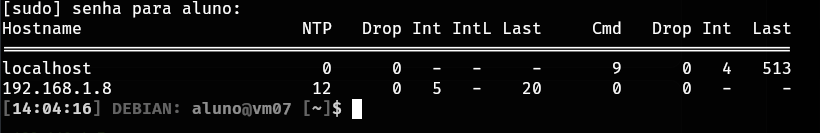

O IP 192.168.1.8 aparece como cliente da vm07, com 12 pacotes NTP recebidos.

4. Na VM2, teste de correção: o relógio foi alterado de propósito para 2020 e depois corrigido pela VM1.

```bash
sudo date -s "2020-01-01 00:00:00"
date
sudo chronyc burst 4/4
chronyc sources
sudo chronyc makestep
date
```

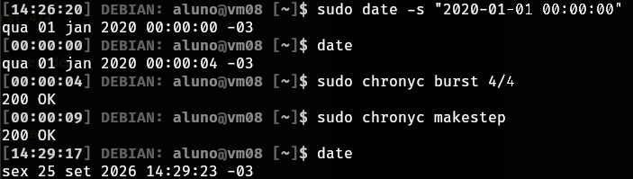

O relógio foi levado a 01/01/2020 e, após `burst` e `makestep`, voltou para 25/09/2026 com a hora correta obtida da VM1.

## Servidor Web

1. Na VM2, conferência de que o Apache escuta nas portas 80 (HTTP) e 443 (HTTPS):

```bash
sudo ss -tlnp | grep apache
```

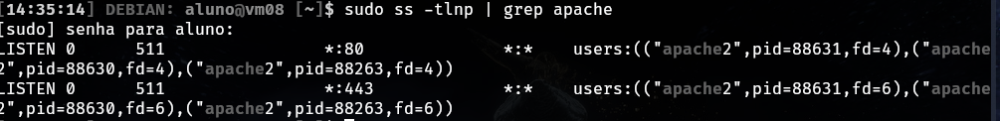

2. No computador pessoal, requisições pelos dois protocolos. Esperado: `HTTP/1.1 200 OK` nas duas.

```bash
curl -I http://192.168.1.8
curl -kI https://192.168.1.8
```

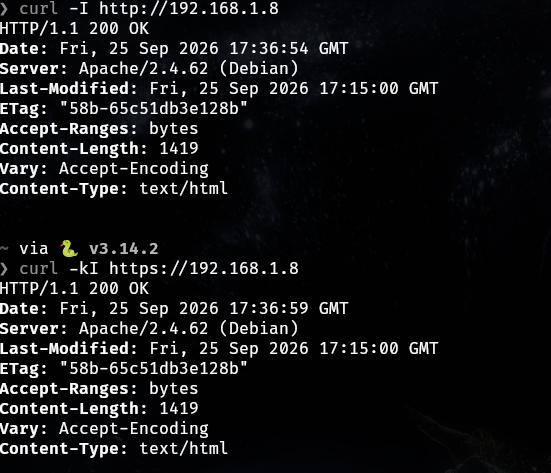

As requisições partiram do computador pessoal, pela VPN, comprovando que o servidor atende clientes na rede.

3. Conferência do certificado apresentado pelo servidor:

```bash
openssl s_client -connect 192.168.1.8:443 </dev/null 2>/dev/null \
  | openssl x509 -noout -subject -dates
```

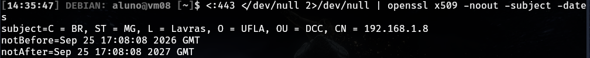

O certificado foi emitido para CN = 192.168.1.8 e é válido de 25/09/2026 a 25/09/2027.

4. No navegador, acesso a `http://192.168.1.8` e `https://192.168.1.8`, incluindo os detalhes do certificado. O aviso de segurança no HTTPS é esperado, pois o certificado é autoassinado.

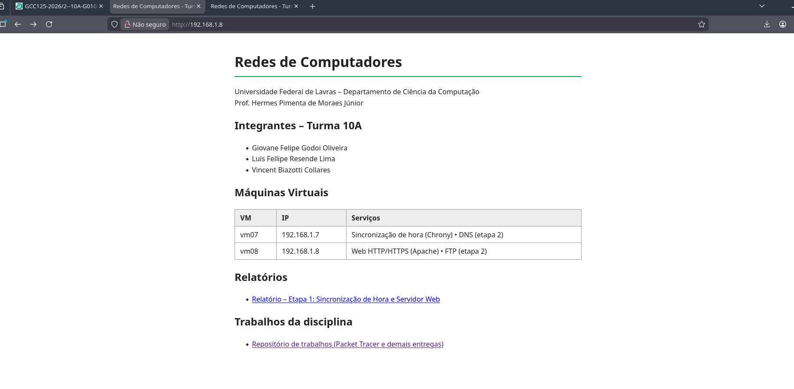

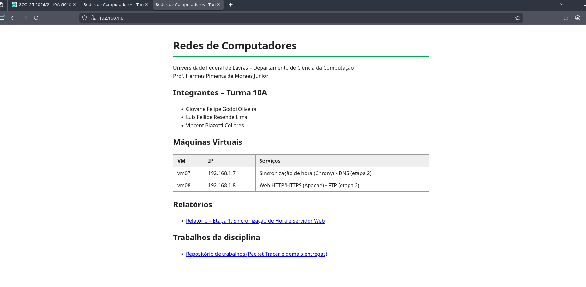

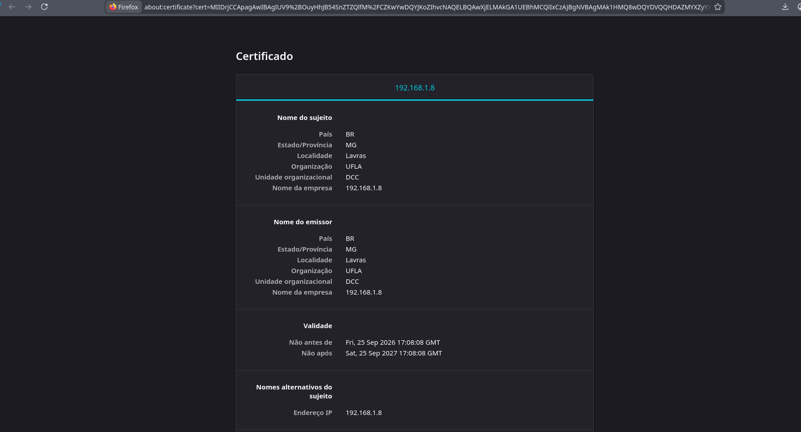

O navegador mostra o certificado emitido para 192.168.1.8 (UFLA/DCC), com validade de 25/09/2026 a 25/09/2027. O aviso de segurança aparece porque o certificado é autoassinado, e não emitido por uma autoridade certificadora.

5. Teste dos links da página para o relatório e para a pasta de trabalhos.

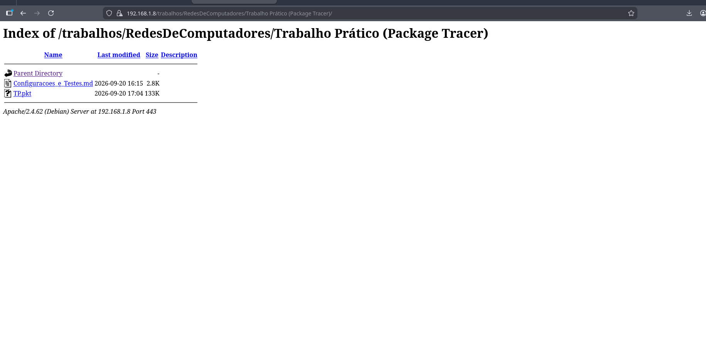
